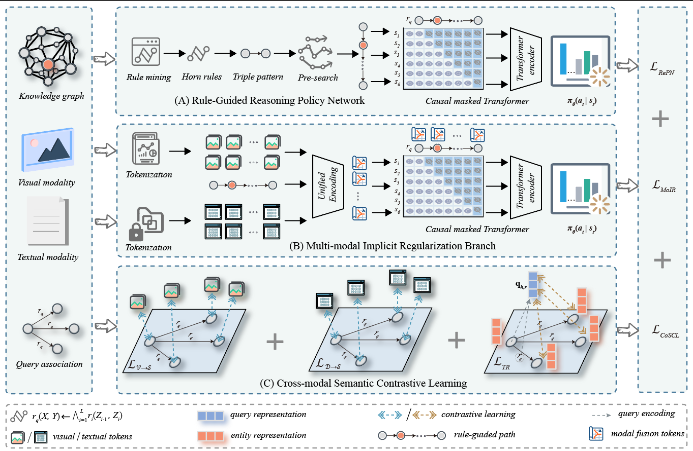

# MCPT: Multi-modal Contrastive Policy Transformer for Knowledge Graph Completion via Unified Tokenization
**💻 Source implementation of our manuscript: MCPT: Multi-modal Contrastive Policy Transformer for Knowledge Graph Completion via Unified Tokenization**

> Authors: Congcong Sun, Miao Ma, Jianrui Chen, Zhao Pei.  
> Institutions: Shaanxi Normal University
---

## 🧩 Overview

---

## 🎆 Manuscript Status 
- `2026-07` Our manuscript **(MCPT: Multi-modal Contrastive Policy Transformer for Knowledge Graph Completion via Unified Tokenization)** was submitted to the TMM journal for consideration. The implementation of MCPT will be made publicly available.

---

## 📬 E-mail

e-mail: congcong\_sun@snnu.edu.cn
